# Web semántica y datos enlazados

Se presenta a continuación el índice seguido para el desarrollo de la práctica:


1. Introducción
2. Proceso de transformación:
	* Selección de la fuente de datos
	* Análisis de los datos
	* Estrategia de nombrado
	* Desarrollo del vocabulario
	* Transformación de datos
	* Enlazado
	* Publicación
3. Aplicación y explotación
4. Conclusiones
5. Bibliografía


## 1. Introducción

En esta tarea se pide poner en práctica los conocimientos adquiridos a lo largo de la asignatura transformando un dataset en formato CSV de nuestra elección a datos enlazados.

Para ello, se ha seleccionado un dataset del portal de datos abiertos del Ayuntamiento de Santander que, con la ayuda de sensores distribuidos por la ciudad, recopilan datos relativos al nivel de ruido, luminosidad y temperatura.

## 2. Proceso de transformación

A lo largo de este apartado se llevarán a cabo cada una de las transformaciones necesarias para conseguir nuestro archivo RDF a partir de nuestro CSV de origen. 


### 2.1. Selección de la fuente de datos

Como se ha mencionado en el apartado de introducción, el CSV de origen, *Sensores ambientales*, se ha obtenido de la página del [portal de datos abiertos del Ayuntamiento de Santander](http://datos.santander.es/resource/?ds=sensores-ambientales&id=cae57038-c092-4743-b575-7bcafd838e02&ft=CSV).  


De entre toda la información a la que el ciudadano tiene acceso en dicho portal, he seleccionado este dataset en concreto para realizar la tarea debido a que me parece interesante la información recogida por los sensores ya que por ejemplo pueden ayudar a un ciudadano a encontrar la mejor zona para comprarse una vivienda en la ciudad. 


### 2.2. Análisis de los datos

El CSV seleccionado para la tarea tiene una licencia [CC BY 4.0](https://creativecommons.org/licenses/by/4.0/deed.es), es decir, podemos utilizar el dataset seleccionado para lo que deseemos, e incluso llegar a hacer modificaciones en el mismo siempre y cuando citemos al autor. Teniéndose esto en cuenta, se llevarán a cabo las transformaciones pertinentes manteniéndose la misma licencia para los datos transformados.


Se detallan a continuación cada una de las variables que componen el dataset:

| Columna | Tipo | Comentarios |
| ------------- | ------------- | -------------|
| dc:identifier | String | Identificador del registro
| dc:modified | String | Fecha y hora en que se tomó el registro expresada según el estándar ISO 8601
| ayto:type | String | Tipo de registro que el sensor va a medir. Toma dos valores posibles *NoiseLevelObserved* para las medidas del nivel de ruido y *WeatherLevelObserved* para las medidas de temperatura y nivel de luminosidad.
| ayto:latitude | String | Coordenadas de latitud que ubican al sensor
| ayto:longitude | String | Coordenadas de longitud que ubican al sensor
| ayto:temperature | String | Temperatura registrada por el sensor medida en grados Celsius. Solamente hay dato de este campo para el tipo *WeatherLevelObserved*. Presenta tres registros con temperaturas anómalas: 228.77 ºC, -39.09 ºC y -36.58ºC.
| ayto:battery | String | Nivel de batería del sensor medido en %. No presenta ningun valor para ningun registro
| ayto:light | String | Luminosidad registrada por el sensor medida en lúmenes. Solamente hay dato de este campo para el tipo *WeatherLevelObserved*. 
| ayto:noise | String | Nivel de ruido registrado por el sensor medido en dB. Solamente hay dato de este campo para el tipo *NoiseLevelObserved*.
| uri | String | URL que permite descargar un resumen de la información presente en el CSV para un registro concreto.


### 2.3. Estrategia de nombrado

Para seleccionar la estrategia de nombrado de los recursos haremos uso de # y /. Concretamente, utilizaremos el hash URIs (#) para los términos ontológicos y dado que el CSV seleccionado aporta información relativa a medidas recogidas por varios sensores, usaremos el slash URIs (/) para acceder a la información de cada una de las observaciones tal y como se describe a continuación:


* Dominio: http://ejemplo-sensores-ambientales.es/.
* Ruta para términos ontológicos: http://ejemplo-sensores-ambientales.es/ayto-santander/ontology/sensores#.
* Ruta para individuos: http://ejemplo-sensores-ambientales.es/ayto-santander/resource/ .


Teniendo esto en cuenta, los patrones para una propiedad y para un recurso específico de nuestro dataset serán:


* Patrón para términos ontológicos: http://ejemplo-sensores-ambientales.es/ayto-santander/ontology/sensores#hasTemperatura. 
* Patrón para individuos: http://ejemplo-sensores-ambientales.es/ayto-santander/resource/sensor/382.


### 2.4. Desarrollo del vocabulario

Se muestra a continuación la relación existente entre cada uno de los vocabularios y propiedades presentes en nuestro dataset.


Recursos principales:


* Identificador del sensor
* Ubicación (coordenadas de latitud y longitud)
* Fecha de medición
* Tipo de medición (ruido o tiempo)
* Mediciones (temperatura, niveles de luz y ruido)
* Nivel de batería del sensor

Propiedades y relaciones entre recursos: 

* Cada sensor tiene una ubicación dada por su latitud y longitud
* Cada sensor recoge una medición en un día y hora determinados
* Cada sensor puede recoger medidas del nivel de ruido
* Las unidades de medida del nivel de ruido son dB
* Cada sensor puede recoger medidas del tiempo atmosférico o clima
* Las unidades de medida de la temperatura y nivel de luz son grados Celsius y lúmenes respectivamente
* Cada sensor tiene un nivel de batería
* Las unidades de medida del nivel de batería son tantos por ciento.

Por otra parte, dado que el CSV seleccionado no presenta columnas que puedan ser objeto de enlazado y todos los registros recogidos en dataset pertenecen al Ayuntamiento de Santander, se procede a crear una nueva columna llamada *Municipio* con valor *Santander*. Con este cambio cuya implementación se llevará a cabo en el apartado siguiente, podemos añadir el recurso principal *Municipio* y la propiedad *Todos los sensores se encuentran en el mismo municipio o ciudad*.


Se muestra a continuación el modelo ontológico basado en los recursos principales y propiedades anteriormente descritos:


Para finalizar con teste apartado, mencionar que se hará uso de ontologías ya existentes. Concretamente, se utilizarán las propiedades geo:lat y geo:long del vocabulario *WGS84 (wsg84_pos:SpatialThing)* para describir las coordenadas geográficas de nuestro dataset así como Wikidata para describir la clase sensor. El municipio o ciudad será descrito mediante la propiedad schema: City del vocabulario *Schema org*.


### 2.5. Proceso de transformación

Para el desarrollo de esta práctica se ha hecho uso de la versión 3.7.2 de la herramienta *OpenRefine* que junto con la *extensión RDF* nos ha permitido transformar un archivo CSV en otro RDF, compuesto de datos enlazados. 


Para llegar a dicho punto, se han llevado a cabo una serie de transformaciones en nuestro dataset de origen y cuyo comienzo ha consistido en la carga del mismo en la herramienta tal y como mostramos a continuación:


El dataset seleccionado está compuesto por un total de 10 atributos y 332 registros. A priori, se observa que los valores de columna de cada atributo no son del todo descriptivos por lo que cambiaremos sus nombres a otros que lo sean más haciendo uso de la opción *Edit column => Remane this column* presente en cada atributo. A continuación, se muestran los cambios llevados a cabo:


| Nombre en CSV | Renombrado |
| ------------- | ------------- |
| dc:identifier | Id |
| dc:modified |  Fecha |
| ayto: type | TipoMedicición  |
| ayto:latitude | Latitud |
| ayto:longitude  | Longitud |
| ayto:temperatura | Temperatura |
| ayto:battery | Bateria |
| ayto:light | NivelLuz |
| ayto:noise | NivelRuido |
| uri | Uri |


Por otra parte, se convierten a número los atributos *ayto:latitude*, *ayto:longitude*, *ayto:temperatura*, *ayto:light* y *ayto:noise* y *ayto:modified* a fecha.

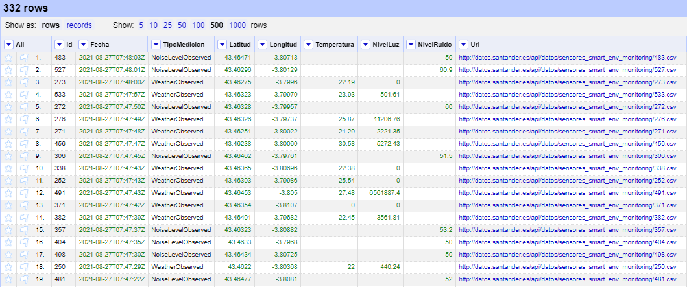


Así mismo, en el apartado anterior, se mencionó que se iba a añadir una nueva columna a nuestro dataset llamada *Municipio* para poder tener al menos un atributo con el que poder realizar enlazamiento en el apartado 2.5. Esta columna, la añadiremos entre los atributos *NivelRuido* y *Uri* y se llamará *Municipio*. Se creará mediante la opción *Edit column => Add column base on this column* de *OpenRefine* y posteriormente, mediante expresiones GREL estableceremos el valor *Santander*. A continuación, se muestra el resultado final obtenido:


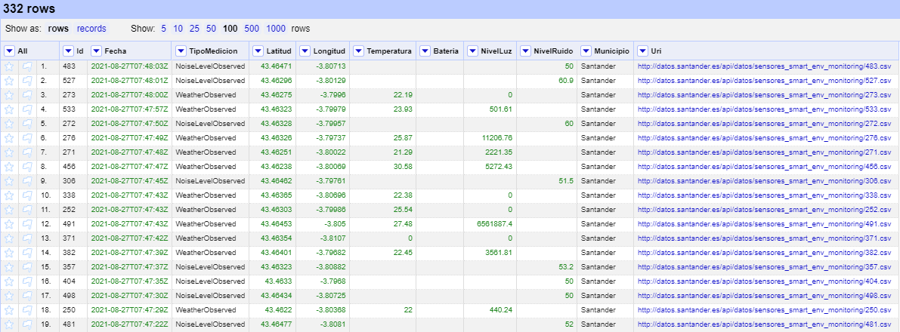


Haciendo uso de las facetas sobre cada uno de los atributos podemos conocer cómo se distribuyen los datos y sacar conclusiones en consecuencia. A continuación, se describen las conclusiones extraídas: 


* El campo *Id* será el que utilizaremos para identificar a cada individuo y construir las URIs de cada recurso ya que se ha comprobado que los valores son únicos.
* El atributo *Batería* no contiene ningún dato para ningún registro y por tanto no aporta valor alguno por lo que se procederá a su eliminación haciendo uso de la opción *Edit column => Remove this column*.
* El atributo *Uri* representa la ruta de cada individuo dada por el portal. Dado que dicha información se puede visualizar en el dataset para todos los individuos, dicho campo se considera redundante y se decide prescindir de él.

Con las transformaciones anteriormente descritas, el dataset limpio con el que trabajaremos será el siguiente:


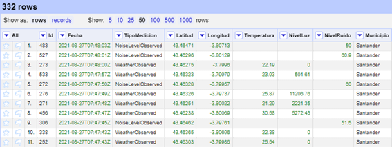


Luego, se llevará a cabo la correspondencia o mapping entre esta tabla de datos recién generada y la ontología, lo que posibilitará la asignación de nombres a todas las instancias contenidas en el conjunto de datos, siguiendo la estrategia de nombrado establecida.


Teniéndose esto en cuenta, comenzamos la construcción del esqueleto RDF introduciendo en la opción *Add* nuestra estrategia de nombrado de recursos, es decir, la URI que hemos creado para definir nuestra ontología (véase apartado 2.3). Dado que ésta no está publicada, para evitar errores en su utilización forzamos su importación.


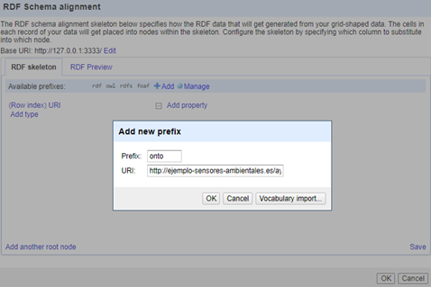


Así mismo, dado que comentamos en apartados anteriores que íbamos a hacer uso de ontologías ya existentes se muestran a continuación qué prefijos hemos utilizado para cada una de ellas:


* geo para la ontología http://www.w3.org/2003/01/geo/wgs84_pos#
* dbpedia para la ontología  http://dbpedia.org/resource/
* schema para la ontología http://schema.org/


Posteriormente, identificamos a los individuos por su tipo (dbpedia:sensor) y su URI. Con respecto a la URI de cada individuo hay que tener en cuenta que hemos de editar la URI que viene por defecto (http://127.0.0.1:3333/) e introducir la que se ha definido con anterioridad (véase apartado 2.3).


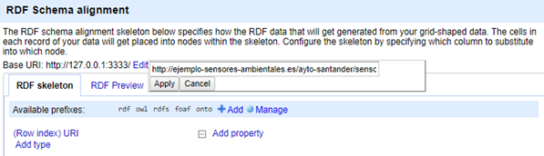


Como hemos identificado a los individuos con el tipo dbpedia:sensor, lo siguiente que hemos de hacer es construir la URI para cada uno de ellos haciéndose uso de la URI base y las expresiones GREL tal y como sigue:


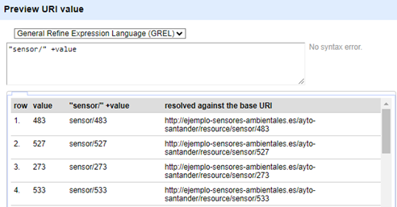


Finalmente, para terminar con la construcción del esqueleto RDF, introducimos las propiedades asociadas a cada individuo. El resultado final se muestra a continuación:


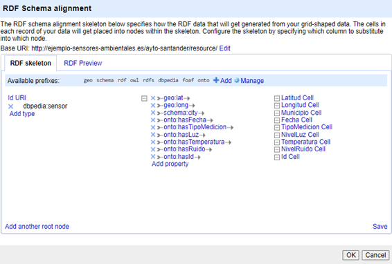


Con el esqueleto RDF ya construido procedemos a su exportación RDF tal y como puede verse a continuación:


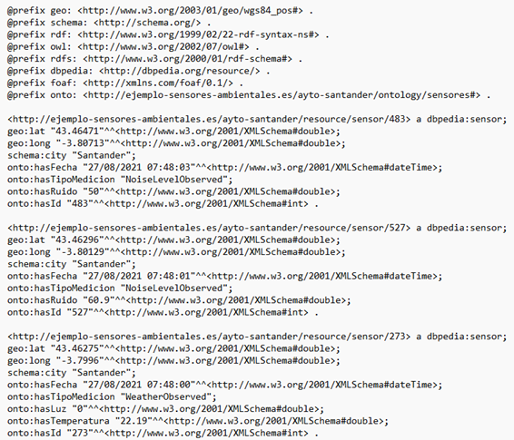


### 2.6. Enlazado

Como se ha explicado en apartados anteriores, el dataset original no contenía información adecuada para enlazar con otras ontologías. Es por ello, que se añadió el campo *Municipio*, que, si bien aporta información redundante a nuestro CSV al pertenecer todos los registros al municipio de Santander, ha sido necesario para la elaboración de este apartado de la tarea.


Dado que dicho campo contiene el nombre de una ciudad se enlazará con la ontología *Wikidata*. 


Para llevar a cabo el proceso de enlazado hacemos uso de la herramienta *OpenRefine* siguiendo los pasos siguientes: 


* Añadimos el servicio de reconciliación basado en SPARQL endpoint que posteriormente nos permitirá ejecutar consultas sobre nuestros datos.
* Reconciliamos la columna *Municipio* mediante el servicio *Wikidata reconci.link (en)*.
* Creamos en nuestro dataset la columna *UriMunicipio* para haciendo uso de la expresión GREL ```http://www.wikidata.org/entity/"+cell.recon.match.id``` mostrar el resultado de la reconciliación. 
* Editamos el esqueleto RDF para añadir la propiedad owl:sameAs y poder indicar que el individuo de nuestro dataset es el mismo que el encontrado en *Wikidata*.


A continuación, se muestra mediante capturas de pantalla cada uno de los pasos anteriormente descritos:


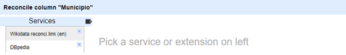


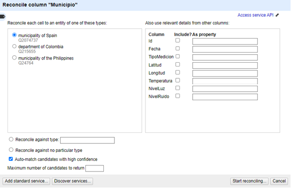


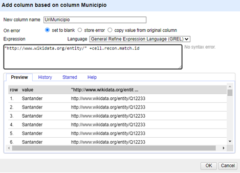


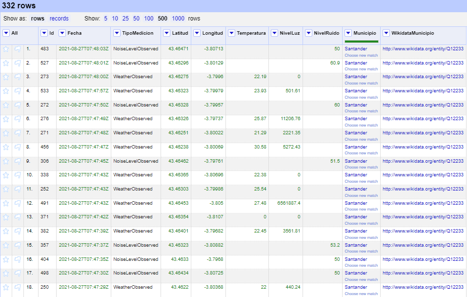


Dado que todos los registros tenían el mismo valor, la reconciliación llevada a cabo ha sido del 100%. 


Finalmente, cabe señalar que para la edición del esqueleto RDF se ha renombrado la columna *UriMunicipio* por *WikidataMunicipio*.


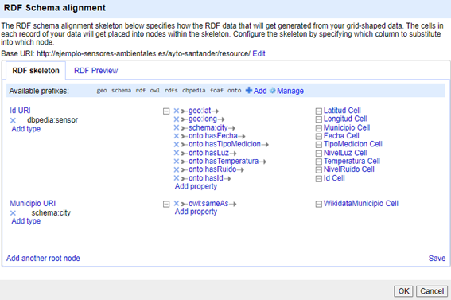


### 2.7. Publicación

Dado que el archivo de datos no se encuentra actualizado (las últimas mediciones tomadas por el sensor datan del 27 de agosto del 2021) se ha optado por no publicar la ontología propia creada a partir de dicho CSV.


## 3. Aplicación y explotación

Una vez tenemos el CSV convertido a datos RDF podemos hacer consultas complejas haciendo uso de SPARQL. Para ello, se ha hecho uso de [Apache Jena Fuseki](https://jena.apache.org/documentation/fuseki2/), un servidor de SPARQL de código abierto que proporciona una interfaz web sencilla sobra la cual hacer consultas a un dataset previamente cargado. Algunos ejemplos de consultas se muestran a continuación:


* Consulta 1: Obtener las coordenadas relativas al registro con identificador 483

```  
PREFIX dbpedia: <http://dbpedia.org/resource/>
PREFIX geo: <http://www.w3.org/2003/01/geo/wgs84_pos#>
PREFIX schema: <http://schema.org/>
PREFIX onto: <http://ejemplo-sensores-ambientales.es/ayto-santander/ontology/sensores#>

SELECT ?sensor ?lat ?long ?tipoMedicion ?id
WHERE {
    ?sensor a dbpedia:sensor ;
		onto:hasId ?id ;
		geo:lat ?lat ;
		geo:long ?long ;
		onto:hasTipoMedicion ?tipoMedicion .
		FILTER (?id = "483"^^<http://www.w3.org/2001/XMLSchema#int>)
}
```

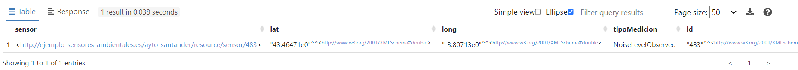


* Consulta 2: Obtener el nivel de ruido promedio registrado por los sensores 

```
PREFIX onto: <http://ejemplo-sensores-ambientales.es/ayto-santander/ontology/sensores#>

SELECT (AVG(?ruido) AS ?promedioRuido)
WHERE {
  ?sensor onto:hasRuido ?ruido .
}
```
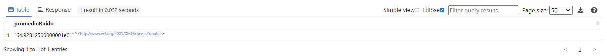


* Consulta 3: Obtener la temperatura máxima registrada junto con la fecha y hora en que se produjo

```
PREFIX onto: <http://ejemplo-sensores-ambientales.es/ayto-santander/ontology/sensores#>

SELECT ?temperatura ?fecha
WHERE {
    ?sensor onto:hasTemperatura ?temperatura ;
            onto:hasFecha ?fecha .
}
ORDER BY DESC(?temperatura)
LIMIT 1
```

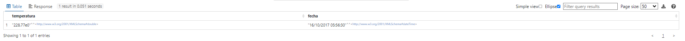


* Consulta 4: Obtener el histórico de registros de los niveles de luz registrados por los sensores ordenados de manera descendente por su valor

```
PREFIX onto: <http://ejemplo-sensores-ambientales.es/ayto-santander/ontology/sensores#>

SELECT ?sensor ?nivelLuz ?fecha
WHERE {
    ?sensor onto:hasLuz ?nivelLuz ;
            onto:hasFecha ?fecha .
}
ORDER BY DESC(?nivelLuz)
```

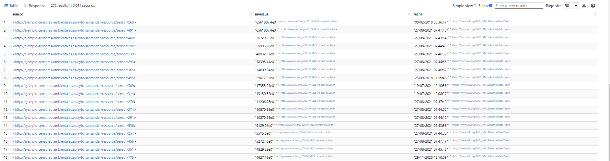


